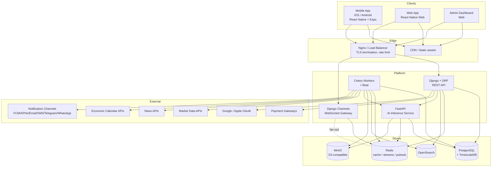
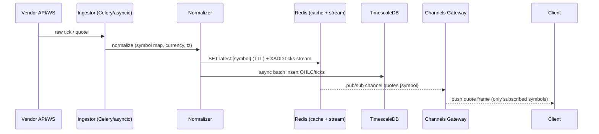
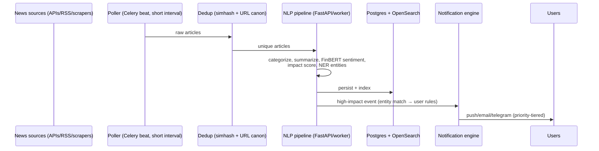
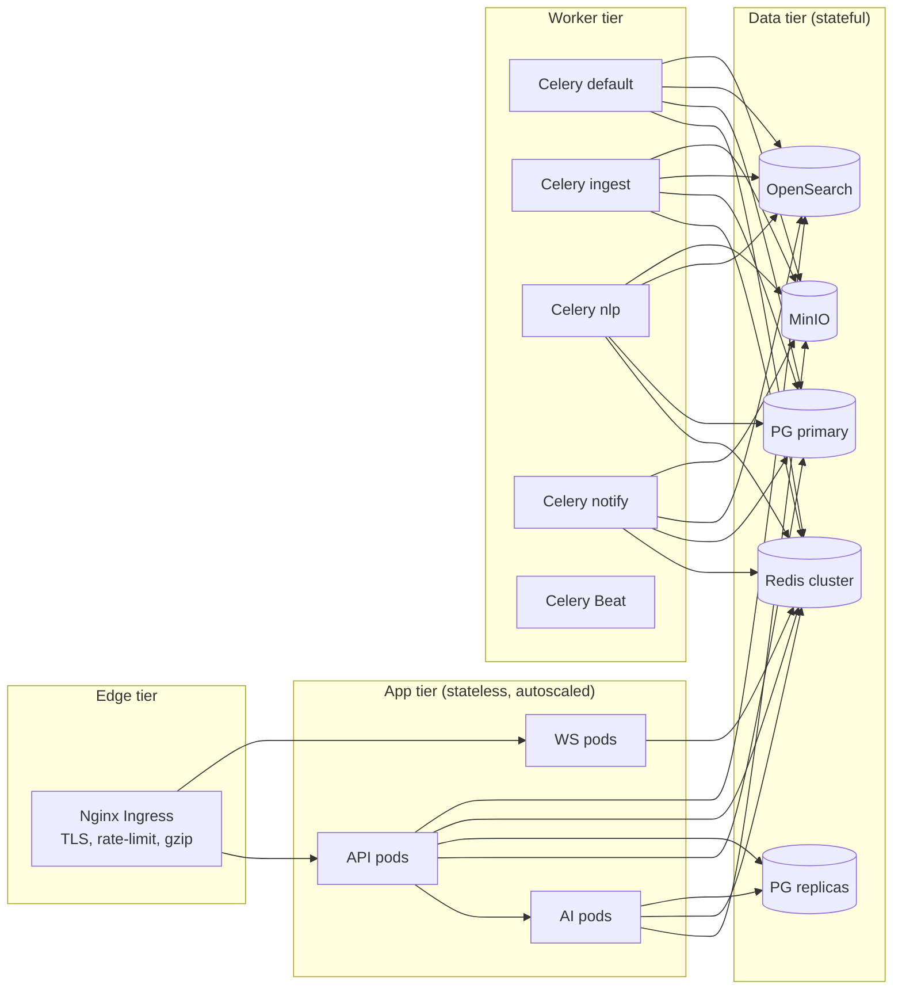

# 2. High-Level Architecture

[← Back to master](../ARCHITECTURE.md)

## 2.1 System context (C4 — Level 1)

## 2.2 Component responsibilities

| Component | Tech | Responsibility | Scaling profile |
|-----------|------|----------------|-----------------|
| **API Service** | Django + DRF (ASGI via Uvicorn/Gunicorn) | Auth, business logic, CRUD, orchestration, serving cached reads | Stateless, horizontal (HPA on CPU/RPS) |
| **WebSocket Gateway** | Django Channels (ASGI) + Redis channel layer | Live quote/news/alert push to clients | Horizontal; sticky not required (Redis pub/sub) |
| **AI Service** | FastAPI + PyTorch/TF/sklearn | Forecasting, sentiment, TA, pattern, recommendation inference | Horizontal; GPU node pool optional; model cache |
| **Workers** | Celery (Redis broker) + Beat | Ingestion, NLP pipeline, scheduled jobs, notification dispatch, model training triggers | Horizontal by queue; priority queues |
| **PostgreSQL** | PG 16 + TimescaleDB ext | OLTP product data + time-series price data | Primary + read replicas; partitioning |
| **Redis** | Redis 7 (cluster) | Cache, Celery broker, Channels layer, Streams, rate-limit counters, pub/sub | Cluster mode, replicas |
| **OpenSearch** | OpenSearch | Full-text search (companies/news/symbols), autocomplete, log analytics | Multi-node cluster |
| **MinIO** | MinIO | Model artifacts, exported reports, chart snapshots, user uploads | Distributed mode |

## 2.3 Why Django + FastAPI split

| Concern | Owner | Reason |
|---------|-------|--------|
| Auth, RBAC, CRUD, billing, admin | **Django** | Batteries-included ORM, admin, mature auth, DRF serializers |
| Real-time fan-out | **Django Channels** | Native ASGI + Redis channel layer, shares models |
| Background jobs | **Celery** | First-class Django integration |
| ML inference & training | **FastAPI** | Lightweight, async, easy to pin to GPU pods, isolated deps (torch/tf), independent deploy cadence, no Django request overhead |

The two communicate via **internal REST (signed service-to-service JWT)** for synchronous inference and **Redis Streams / Celery** for async (e.g., bulk news sentiment).

## 2.4 Data flow — market data (real-time path)

Key design points:
- Clients **subscribe** to specific channels (`quotes.AAPL`, `news.IN`, `alerts.{userId}`) — server never broadcasts everything.
- Latest-quote reads come from Redis (`O(1)`), historical from TimescaleDB hypertables.
- Writes to TS are **batched** (e.g., 250ms or 500-row windows) to protect the DB.

## 2.5 Data flow — news (fastest-notification path)

## 2.6 Deployment topology (logical)

v1 ships on **Docker Compose** (single host / small cluster). The same containers are Kubernetes-ready (manifests/Helm chart added at scale — see [DevOps](10-devops-deployment.md)).

## 2.7 Environments
`local` → `dev` → `staging` → `production`, each fully isolated (own DB, Redis namespace, buckets, secrets). Config via environment variables only (12-factor).

## 2.8 Cross-cutting concerns
- **Observability:** structured JSON logs → OpenSearch; metrics (Prometheus) → Grafana; tracing (OpenTelemetry) across API→AI→workers; Sentry for errors.
- **Idempotency:** all ingestion keyed by source-id; notifications deduped by `(rule, event, user)` hash.
- **Backpressure:** bounded queues; drop-oldest for non-critical streams, never for alerts/payments.
- **Feature flags:** central table + Redis cache, evaluated per request (see [Admin](09-admin-panel.md)).
