# 5 & 6. Database Schema + ER Diagram

[← Back to master](../ARCHITECTURE.md)

**Engine:** PostgreSQL 16 + **TimescaleDB** (for `*_prices` time-series), Redis (cache/hot), OpenSearch (search/logs).

## Conventions (apply to every table unless noted)
- **PK:** `id UUID DEFAULT gen_random_uuid()` (product tables). Time-series tables use composite `(symbol_id, ts)` + hypertable.
- **Timestamps:** `created_at TIMESTAMPTZ NOT NULL DEFAULT now()`, `updated_at TIMESTAMPTZ NOT NULL DEFAULT now()` (trigger-maintained).
- **Soft delete:** `deleted_at TIMESTAMPTZ NULL` (partial indexes use `WHERE deleted_at IS NULL`).
- **FKs:** `ON DELETE` chosen per relation (RESTRICT for reference data, CASCADE for owned children).
- **Money:** `NUMERIC(20,8)` (never float). **Currency:** ISO-4217 `CHAR(3)`.
- **Enums:** Postgres enums or `VARCHAR + CHECK`.
- **Indexing:** every FK indexed; common filters get composite/partial indexes; search text → OpenSearch, not LIKE.

---

## 5.1 Identity & Access

### `users`
| Column | Type | Notes |
|--------|------|-------|
| id | UUID PK | |
| email | CITEXT UNIQUE NOT NULL | |
| phone | VARCHAR(20) UNIQUE NULL | E.164 |
| password_hash | TEXT NULL | null when OAuth-only |
| full_name | VARCHAR(150) | |
| status | ENUM(active, suspended, deleted, pending) | |
| email_verified_at | TIMESTAMPTZ NULL | |
| phone_verified_at | TIMESTAMPTZ NULL | |
| is_2fa_enabled | BOOL DEFAULT false | |
| last_login_at | TIMESTAMPTZ NULL | |
| created_at / updated_at / deleted_at | | |

Indexes: `UNIQUE(email)`, `UNIQUE(phone)`, `idx_users_status (status) WHERE deleted_at IS NULL`.

### `profiles` (1:1 users)
`id`, `user_id FK→users UNIQUE`, `avatar_url`, `country_id FK→countries`, `timezone`, `base_currency CHAR(3)`, `language CHAR(5)`, `bio`, `experience_level ENUM(beginner,intermediate,pro)`, `risk_appetite ENUM(low,med,high)`, timestamps.

### `roles`
`id`, `name UNIQUE` (super_admin, admin, moderator, premium, free, guest), `description`, `is_system BOOL`, timestamps.

### `permissions`
`id`, `code UNIQUE` (e.g. `news.publish`, `ai.train`, `user.suspend`), `description`, `resource`, `action`.

### `role_permissions` (M:N)
`role_id FK→roles`, `permission_id FK→permissions`, PK(role_id, permission_id).

### `user_roles` (M:N)
`user_id FK→users`, `role_id FK→roles`, `granted_by FK→users NULL`, `granted_at`, PK(user_id, role_id).

### `sessions`
`id`, `user_id FK`, `device_id FK→devices NULL`, `refresh_token_hash`, `ip INET`, `user_agent`, `expires_at`, `revoked_at NULL`, `created_at`. Index `(user_id) WHERE revoked_at IS NULL`.

### `oauth_accounts`
`id`, `user_id FK`, `provider ENUM(google,apple)`, `provider_uid`, `email`, `raw_profile JSONB`, timestamps. `UNIQUE(provider, provider_uid)`.

### `devices`
`id`, `user_id FK`, `platform ENUM(ios,android,web)`, `push_token`, `device_name`, `app_version`, `last_seen_at`, `is_trusted BOOL`, timestamps. `UNIQUE(user_id, push_token)`.

### `login_history`
`id`, `user_id FK`, `event ENUM(login,logout,failed,2fa_challenge)`, `ip INET`, `user_agent`, `location JSONB`, `success BOOL`, `created_at`. Index `(user_id, created_at DESC)`.

### `otp_codes`
`id`, `user_id FK NULL`, `target` (email/phone), `channel ENUM(email,sms)`, `code_hash`, `purpose ENUM(login,verify,reset,2fa)`, `expires_at`, `consumed_at NULL`, `attempts INT`, `created_at`.

### `api_keys`
`id`, `user_id FK NULL` (or service), `name`, `key_prefix`, `key_hash`, `scopes JSONB`, `rate_limit_tier`, `last_used_at`, `expires_at`, `revoked_at NULL`, timestamps.

---

## 5.2 Reference / Market Metadata

### `countries`
`id`, `iso2 CHAR(2) UNIQUE`, `iso3 CHAR(3)`, `name`, `currency CHAR(3)`, `flag_emoji`, `timezone`.

### `markets`
`id`, `code UNIQUE` (e.g. `EQ_IN`, `FX`, `COMM`), `name`, `asset_class ENUM(equity,forex,commodity,index,etf,crypto)`, `region`, timestamps.

### `exchanges`
`id`, `code UNIQUE` (NSE, BSE, NASDAQ, NYSE, LSE…), `name`, `country_id FK`, `market_id FK`, `timezone`, `open_time`, `close_time`, `currency CHAR(3)`, `is_active BOOL`, timestamps.

### `companies`
`id`, `name`, `legal_name`, `country_id FK`, `sector_id FK→sectors`, `industry`, `description`, `website`, `logo_url`, `employees INT`, `market_cap NUMERIC`, `isin VARCHAR(12) UNIQUE NULL`, `figi VARCHAR(12) NULL`, timestamps.

### `sectors`
`id`, `code UNIQUE`, `name`, `parent_id FK→sectors NULL` (industry tree).

### `instruments` (polymorphic super-type — optional unifying table)
`id`, `asset_class ENUM(...)`, `symbol`, `exchange_id FK NULL`, `display_name`, `currency CHAR(3)`, `is_active BOOL`, `metadata JSONB`. Subtype tables below carry class-specific columns and reference back.

### `stocks`
`id`, `instrument_id FK NULL`, `company_id FK→companies`, `exchange_id FK→exchanges`, `ticker VARCHAR(20)`, `isin`, `lot_size INT`, `face_value NUMERIC`, `currency CHAR(3)`, `is_active BOOL`, timestamps. `UNIQUE(exchange_id, ticker)`.

### `etfs`
`id`, `instrument_id FK NULL`, `exchange_id FK`, `ticker`, `name`, `underlying_index_id FK→indices NULL`, `expense_ratio NUMERIC`, `aum NUMERIC`, `issuer`, timestamps.

### `forex_pairs`
`id`, `base CHAR(3)`, `quote CHAR(3)`, `symbol VARCHAR(7)` (e.g. EURUSD), `pip_decimal INT`, `is_active BOOL`, timestamps. `UNIQUE(base, quote)`.

### `commodities`
`id`, `symbol`, `name`, `category ENUM(metal,energy,agri,livestock)`, `unit`, `currency CHAR(3)`, `exchange_id FK NULL`, timestamps.

### `indices`
`id`, `symbol` (NIFTY50, SENSEX, SPX, DJI…), `name`, `country_id FK`, `exchange_id FK NULL`, `constituents_count INT`, `methodology`, timestamps.

### `cryptocurrencies` (future-ready)
`id`, `symbol`, `name`, `slug`, `coingecko_id`, `max_supply NUMERIC`, `is_active BOOL DEFAULT false`, timestamps.

### `index_constituents` (M:N indices↔stocks)
`index_id FK`, `stock_id FK`, `weight NUMERIC`, `as_of DATE`, PK(index_id, stock_id, as_of).

### `symbol_aliases` (vendor symbol mapping)
`id`, `instrument_kind`, `instrument_id`, `provider`, `provider_symbol`, `UNIQUE(provider, provider_symbol)`. Powers the integrations anti-corruption layer.

---

## 5.3 Time-series prices (TimescaleDB hypertables)

> Each `*_prices` table is a hypertable partitioned by `ts` (chunk interval 1–7 days), with compression on chunks older than N days and continuous aggregates for 1m→5m→1h→1d rollups.

### `stock_prices`
| Column | Type |
|--------|------|
| stock_id | UUID FK→stocks |
| ts | TIMESTAMPTZ NOT NULL |
| interval | ENUM(tick,1m,5m,15m,1h,1d) |
| open / high / low / close | NUMERIC(20,8) |
| volume | NUMERIC(24,4) |
| vwap | NUMERIC(20,8) NULL |
| source | VARCHAR |

PK / dedup: `UNIQUE(stock_id, interval, ts)`. Hypertable on `ts`. Index `(stock_id, interval, ts DESC)`.

### `forex_prices`
`forex_pair_id FK`, `ts`, `interval`, `open/high/low/close`, `bid`, `ask`, `source`. `UNIQUE(forex_pair_id, interval, ts)`.

### `commodity_prices`
`commodity_id FK`, `ts`, `interval`, OHLC, `volume`, `source`. `UNIQUE(commodity_id, interval, ts)`.

### `index_prices`
`index_id FK`, `ts`, `interval`, OHLC, `source`. `UNIQUE(index_id, interval, ts)`.

### `crypto_prices` (future)
`crypto_id FK`, `ts`, `interval`, OHLC, `volume`, `market_cap`. `UNIQUE(crypto_id, interval, ts)`.

### `technical_indicators`
`id`, `instrument_kind`, `instrument_id`, `interval`, `ts`, `indicator ENUM(rsi,macd,ema,sma,vwap,atr,adx,ichimoku,bbands,fib)`, `params JSONB`, `values JSONB` (multi-line indicators), `source`. Index `(instrument_kind, instrument_id, indicator, interval, ts DESC)`. Often computed on read & cached; persisted for popular symbols.

---

## 5.4 News & Events

### `news_categories`
`id`, `slug UNIQUE`, `name`, `parent_id FK→news_categories NULL`.

### `news`
| Column | Type | Notes |
|--------|------|-------|
| id | UUID PK | |
| source | VARCHAR | provider name |
| source_url | TEXT | canonicalized |
| url_hash | CHAR(64) UNIQUE | dedup (sha256 of canon URL) |
| simhash | BIGINT | near-dup detection |
| title | TEXT | |
| body | TEXT | |
| summary | TEXT NULL | AI-generated |
| author | VARCHAR NULL | |
| image_url | TEXT NULL | |
| language | CHAR(5) | |
| published_at | TIMESTAMPTZ | indexed DESC |
| ingested_at | TIMESTAMPTZ | |
| category_id | FK→news_categories NULL | |
| impact_score | SMALLINT | 0–100 |
| is_breaking | BOOL | |
| status | ENUM(ingested,processed,published,rejected) | |
| created_at/updated_at/deleted_at | | |

Indexes: `UNIQUE(url_hash)`, `(published_at DESC)`, `(category_id, published_at DESC)`, `(impact_score DESC)`. Full text → OpenSearch index `news`.

### `news_sentiment`
`id`, `news_id FK UNIQUE`, `model_version_id FK→model_versions`, `label ENUM(positive,negative,neutral)`, `score NUMERIC(5,4)` (−1..1), `confidence NUMERIC(5,4)`, `created_at`.

### `news_entities` (extracted via NER)
`id`, `news_id FK`, `entity_type ENUM(company,ticker,person,currency,commodity,country,org)`, `entity_text`, `linked_kind NULL`, `linked_id UUID NULL` (resolved to stocks/companies/forex_pairs…), `salience NUMERIC`, `created_at`. Index `(linked_kind, linked_id)`, `(news_id)`.

### `market_events`
`id`, `type ENUM(earnings,dividend,split,ipo,merger,policy,halt)`, `instrument_kind`, `instrument_id`, `title`, `details JSONB`, `event_time TIMESTAMPTZ`, `impact ENUM(low,med,high)`, `source`, timestamps. Index `(instrument_kind,instrument_id,event_time)`.

### `economic_calendar`
`id`, `country_id FK`, `event_name`, `category` (CPI, GDP, NFP, rate decision…), `importance ENUM(low,med,high)`, `event_time TIMESTAMPTZ`, `actual`, `forecast`, `previous`, `unit`, `source`, timestamps. Index `(event_time)`, `(country_id, event_time)`, `(importance)`.

---

## 5.5 User Domain (watchlists, portfolio, alerts)

### `watchlists`
`id`, `user_id FK`, `name`, `is_default BOOL`, `sort_order INT`, `color`, timestamps. Index `(user_id)`.

### `watchlist_items`
`id`, `watchlist_id FK`, `instrument_kind`, `instrument_id`, `position INT`, `added_at`, `notes`. `UNIQUE(watchlist_id, instrument_kind, instrument_id)`.

### `portfolios`
`id`, `user_id FK`, `name`, `base_currency CHAR(3)`, `is_default BOOL`, `cash_balance NUMERIC(20,8)`, timestamps. Index `(user_id)`.

### `portfolio_assets` (holdings)
`id`, `portfolio_id FK`, `instrument_kind`, `instrument_id`, `quantity NUMERIC(24,8)`, `avg_cost NUMERIC(20,8)`, `currency CHAR(3)`, `opened_at`, timestamps. `UNIQUE(portfolio_id, instrument_kind, instrument_id)`.

### `transactions`
`id`, `portfolio_id FK`, `instrument_kind`, `instrument_id`, `type ENUM(buy,sell,dividend,deposit,withdraw,fee)`, `quantity NUMERIC`, `price NUMERIC`, `amount NUMERIC`, `currency CHAR(3)`, `fees NUMERIC`, `executed_at`, `note`, timestamps. Index `(portfolio_id, executed_at DESC)`.

### `orders` (FUTURE — feature-flagged, no execution v1)
`id`, `user_id FK`, `portfolio_id FK`, `instrument_kind`, `instrument_id`, `side ENUM(buy,sell)`, `order_type ENUM(market,limit,stop)`, `quantity`, `limit_price NULL`, `status ENUM(draft,pending,filled,cancelled,rejected)`, `placed_at`, timestamps.

### `bookmarks`
`id`, `user_id FK`, `target_kind ENUM(news,stock,forex,analysis,chart)`, `target_id`, `created_at`. `UNIQUE(user_id, target_kind, target_id)`.

---

## 5.6 Alerts & Notifications

### `alert_rules`
| Column | Type | Notes |
|--------|------|-------|
| id | UUID PK | |
| user_id | FK→users | |
| name | VARCHAR | |
| instrument_kind / instrument_id | | nullable for news/macro alerts |
| trigger_type | ENUM(price_above,price_below,pct_change,volume_spike,indicator_cross,news_keyword,sentiment,economic_event) | |
| condition | JSONB | threshold, operator, indicator params, keywords |
| frequency | ENUM(once,recurring) | |
| cooldown_seconds | INT | anti-spam |
| channels | JSONB | [push,email,telegram…] |
| priority | ENUM(critical,high,medium,low) | |
| is_active | BOOL | |
| last_triggered_at | TIMESTAMPTZ NULL | |
| expires_at | NULL | |
| created_at/updated_at/deleted_at | | |

Index `(user_id, is_active)`, `(instrument_kind, instrument_id, is_active)`, `(trigger_type)`.

### `alerts` (fired instances / history)
`id`, `alert_rule_id FK`, `user_id FK`, `triggered_at`, `snapshot JSONB` (value at trigger), `status ENUM(pending,sent,failed)`, `created_at`. Index `(user_id, triggered_at DESC)`.

### `notifications`
`id`, `user_id FK`, `type ENUM(alert,news,system,billing,ai,marketing)`, `priority ENUM(critical,high,medium,low)`, `title`, `body`, `data JSONB`, `channels JSONB`, `read_at NULL`, `created_at`. Index `(user_id, created_at DESC)`, `(user_id) WHERE read_at IS NULL`.

### `notification_deliveries` (per-channel attempt log)
`id`, `notification_id FK`, `channel ENUM(push,email,sms,telegram,whatsapp,desktop)`, `status ENUM(queued,sent,delivered,failed,retrying)`, `provider_message_id`, `error`, `attempts INT`, `sent_at`, timestamps.

### `notification_preferences`
`id`, `user_id FK UNIQUE`, `channels JSONB` (per-type per-channel matrix), `quiet_hours JSONB` (start,end,tz), `digest ENUM(off,daily,weekly)`, `marketing_opt_in BOOL`, timestamps.

---

## 5.7 Subscriptions & Payments

### `subscription_plans`
`id`, `code UNIQUE` (free, pro, elite), `name`, `price NUMERIC`, `currency CHAR(3)`, `interval ENUM(month,year)`, `features JSONB` (entitlements), `limits JSONB` (alerts, watchlist size, AI calls/day), `is_active BOOL`, timestamps.

### `subscriptions`
`id`, `user_id FK`, `plan_id FK`, `status ENUM(trialing,active,past_due,canceled,expired)`, `provider ENUM(stripe,razorpay,apple_iap,google_iap)`, `provider_subscription_id`, `current_period_start`, `current_period_end`, `cancel_at_period_end BOOL`, `trial_end NULL`, timestamps. Index `(user_id, status)`.

### `payments`
`id`, `user_id FK`, `subscription_id FK NULL`, `provider`, `provider_payment_id`, `amount NUMERIC`, `currency CHAR(3)`, `status ENUM(created,succeeded,failed,refunded)`, `method`, `invoice_url`, `raw JSONB`, `paid_at`, timestamps. Index `(user_id, created_at DESC)`, `UNIQUE(provider, provider_payment_id)`.

### `invoices`
`id`, `user_id FK`, `subscription_id FK NULL`, `number UNIQUE`, `amount`, `tax`, `currency`, `status`, `pdf_url`, `period_start`, `period_end`, timestamps.

### `entitlements` (resolved feature access cache)
`id`, `user_id FK UNIQUE`, `plan_code`, `features JSONB`, `limits JSONB`, `valid_until`, `updated_at`. Read on every gated request (cached in Redis).

---

## 5.8 AI / ML

### `ml_models`
`id`, `name UNIQUE` (e.g. `forecast_lstm_equity`), `task ENUM(forecast,sentiment,technical,pattern,risk,recommend)`, `family ENUM(lstm,gru,transformer,xgboost,random_forest,arima,sarima,prophet,finbert)`, `description`, `is_active BOOL`, timestamps.

### `model_versions`
`id`, `model_id FK`, `version SEMVER`, `artifact_uri` (MinIO), `framework`, `metrics JSONB` (rmse, mae, accuracy, f1…), `hyperparams JSONB`, `trained_on DATERANGE`, `status ENUM(staging,production,archived)`, `promoted_at`, timestamps. `UNIQUE(model_id, version)`.

### `training_jobs`
`id`, `model_id FK`, `triggered_by FK→users NULL`, `status ENUM(queued,running,succeeded,failed,canceled)`, `config JSONB`, `dataset_ref`, `metrics JSONB`, `logs_uri`, `started_at`, `finished_at`, timestamps. Index `(model_id, created_at DESC)`.

### `ai_predictions`
`id`, `model_version_id FK`, `instrument_kind`, `instrument_id`, `prediction_type ENUM(price_forecast,trend,signal,risk,sentiment)`, `horizon` (e.g. `1d`,`7d`), `target_ts TIMESTAMPTZ`, `value JSONB` (point + interval / class probs), `confidence NUMERIC(5,4)`, `features_ref`, `created_at`. Index `(instrument_kind, instrument_id, prediction_type, created_at DESC)`.

### `prediction_history` (accuracy tracking — predicted vs actual)
`id`, `prediction_id FK`, `actual_value NUMERIC NULL`, `error NUMERIC NULL`, `evaluated_at NULL`, `created_at`. Powers model drift dashboards.

### `historical_analysis` (analog/“this looks like” comparisons)
`id`, `instrument_kind`, `instrument_id`, `pattern`, `reference_period DATERANGE`, `matched_periods JSONB`, `similarity NUMERIC`, `outcome JSONB`, `generated_by FK→model_versions`, `created_at`.

### `recommendations`
`id`, `user_id FK`, `instrument_kind`, `instrument_id`, `type ENUM(watch,buy_idea,risk_warning,diversify)`, `rationale TEXT`, `score NUMERIC`, `confidence NUMERIC`, `model_version_id FK`, `shown_at NULL`, `clicked_at NULL`, `created_at`. Index `(user_id, created_at DESC)`.

### `ai_conversations` / `ai_messages` (LLM assistant)
`ai_conversations`: `id`, `user_id FK`, `title`, `created_at`. 
`ai_messages`: `id`, `conversation_id FK`, `role ENUM(user,assistant,system,tool)`, `content`, `tool_calls JSONB`, `tokens INT`, `created_at`.

---

## 5.9 Personalization & Misc

### `saved_charts`
`id`, `user_id FK`, `name`, `instrument_kind`, `instrument_id`, `interval`, `indicators JSONB`, `drawings JSONB`, `snapshot_url NULL`, `is_public BOOL`, timestamps.

### `saved_filters` / `saved_searches`
`id`, `user_id FK`, `domain ENUM(screener,news,calendar)`, `name`, `query JSONB`, `notify BOOL`, timestamps.

### `search_history`
`id`, `user_id FK NULL`, `query`, `result_kind`, `result_id NULL`, `created_at`. Feeds autocomplete/personalization.

---

## 5.10 Platform / Ops

### `audit_logs`
`id`, `actor_id FK→users NULL`, `actor_type ENUM(user,admin,system,api_key)`, `action`, `resource_type`, `resource_id`, `before JSONB`, `after JSONB`, `ip INET`, `user_agent`, `created_at`. Index `(resource_type, resource_id)`, `(actor_id, created_at DESC)`. **Append-only**, no soft delete.

### `system_settings`
`id`, `key UNIQUE`, `value JSONB`, `category`, `description`, `updated_by FK→users`, timestamps.

### `feature_flags`
`id`, `key UNIQUE`, `description`, `is_enabled BOOL`, `rollout_percent SMALLINT`, `rules JSONB` (per-plan/role/region targeting), `updated_by FK`, timestamps. Cached in Redis.

### `analytics_events`
`id`, `user_id FK NULL`, `session_id`, `event_name`, `properties JSONB`, `platform`, `app_version`, `created_at`. High-volume → partition by `created_at`, also streamed to OpenSearch.

### `data_provider_status`
`id`, `provider`, `domain ENUM(market,news,economic)`, `status ENUM(ok,degraded,down)`, `quota_used`, `quota_limit`, `last_success_at`, `last_error`, `updated_at`. Drives failover between providers.

---

## 6. ER Diagram (Mermaid)

> Core relationships (subset for readability — time-series and ops tables shown grouped).

```mermaid
erDiagram
    users ||--|| profiles : has
    users ||--o{ user_roles : assigned
    roles ||--o{ user_roles : grants
    roles ||--o{ role_permissions : has
    permissions ||--o{ role_permissions : in
    users ||--o{ sessions : owns
    users ||--o{ oauth_accounts : links
    users ||--o{ devices : registers
    users ||--o{ login_history : records
    users ||--o{ api_keys : owns

    countries ||--o{ exchanges : hosts
    markets ||--o{ exchanges : groups
    countries ||--o{ companies : domiciles
    sectors ||--o{ companies : classifies
    exchanges ||--o{ stocks : lists
    companies ||--o{ stocks : issues
    exchanges ||--o{ etfs : lists
    indices ||--o{ index_constituents : contains
    stocks ||--o{ index_constituents : member

    stocks ||--o{ stock_prices : has
    forex_pairs ||--o{ forex_prices : has
    commodities ||--o{ commodity_prices : has
    indices ||--o{ index_prices : has
    cryptocurrencies ||--o{ crypto_prices : has

    news_categories ||--o{ news : categorizes
    news ||--|| news_sentiment : scored
    news ||--o{ news_entities : extracts

    users ||--o{ watchlists : owns
    watchlists ||--o{ watchlist_items : contains
    users ||--o{ portfolios : owns
    portfolios ||--o{ portfolio_assets : holds
    portfolios ||--o{ transactions : records
    users ||--o{ bookmarks : saves

    users ||--o{ alert_rules : defines
    alert_rules ||--o{ alerts : fires
    users ||--o{ notifications : receives
    notifications ||--o{ notification_deliveries : sent_via
    users ||--|| notification_preferences : configures

    subscription_plans ||--o{ subscriptions : sold_as
    users ||--o{ subscriptions : holds
    users ||--o{ payments : makes
    subscriptions ||--o{ payments : billed
    users ||--|| entitlements : resolves

    ml_models ||--o{ model_versions : versions
    ml_models ||--o{ training_jobs : trains
    model_versions ||--o{ ai_predictions : produces
    ai_predictions ||--|| prediction_history : evaluated
    model_versions ||--o{ recommendations : powers
    users ||--o{ recommendations : targeted
    users ||--o{ ai_conversations : starts
    ai_conversations ||--o{ ai_messages : contains

    users ||--o{ saved_charts : saves
    users ||--o{ saved_searches : saves
    users ||--o{ audit_logs : actor
    countries ||--o{ economic_calendar : schedules
```

### Partitioning & retention summary
| Table group | Strategy |
|-------------|----------|
| `*_prices`, `technical_indicators` | TimescaleDB hypertables; compress chunks > 14d; continuous aggregates for rollups; drop raw ticks > 90d (keep 1m+). |
| `analytics_events`, `notification_deliveries`, `login_history` | Native range partition by month; retain 12–24 months. |
| `audit_logs` | Range partition by month; retain per compliance (≥ 7y for billing). |
| OLTP product tables | No partition; read replicas + Redis cache for hot reads. |
