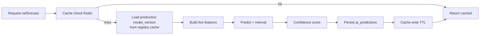

# 8. AI Architecture

[← Back to master](../ARCHITECTURE.md)

The AI layer is a **separate FastAPI service** (`ai_service/`) with its own deps (PyTorch, TensorFlow, HuggingFace, scikit-learn, XGBoost, Prophet, statsmodels, pandas, numpy), its own scaling profile, and an optional GPU node pool. Django calls it over signed service-to-service HTTP (interactive) or Celery (batch).

## 8.1 Module map

| Module | Models | Input | Output |
|--------|--------|-------|--------|
| **Price Forecast** | LSTM, GRU, Transformer, Prophet, ARIMA/SARIMA, XGBoost (ensemble) | OHLCV history + engineered features | Point forecast + prediction interval + confidence |
| **News Sentiment** | FinBERT, sentence-transformers | News text | label {pos/neg/neutral}, score [−1,1], confidence |
| **Technical Analysis** | Rule + ML signal engine | OHLCV + indicators | signals (buy/sell/hold), strength, indicator values |
| **Pattern Recognition** | CNN/Transformer on chart windows + rule-based | OHLCV windows | patterns (H&S, double-top, triangles…) + location + reliability |
| **Risk Analysis** | XGBoost/Random Forest + statistical | returns, volatility, drawdown, correlation | risk score, VaR, volatility regime |
| **Historical Comparison** | embedding + nearest-neighbor (FAISS/OpenSearch kNN) | normalized price window | analog periods + subsequent outcome distribution |
| **Recommendation** | hybrid (content + collaborative + rules) | user profile, holdings, behavior, market state | ranked ideas + rationale + confidence |
| **LLM Assistant** | Claude (Anthropic API) + RAG over our data | user question + tool access to our APIs | grounded answer with citations |

## 8.2 Service layout (recap)
```
ai_service/app/
├── api/v1/{forecast,sentiment,technical,patterns,risk,recommend,assistant}.py
├── models/{forecasting,nlp,technical}/ + registry.py
├── pipelines/{training,inference,features}/
├── schemas/    # pydantic I/O
└── core/       # config, cache, metrics, model loading
```

## 8.3 Feature engineering (`pipelines/features`)
Shared between training and inference to avoid train/serve skew:
- **Price features:** returns (log/simple), rolling mean/std, RSI, MACD, EMA/SMA, Bollinger width, ATR, ADX, volume z-score, VWAP distance.
- **Calendar features:** day-of-week, month, holiday/session flags, days-to-earnings.
- **Sentiment features:** rolling news sentiment, news count, impact-weighted sentiment, event proximity.
- **Macro features:** relevant economic-calendar surprises, sector index returns, FX moves.
- All features versioned via a **feature spec** stored with each model version (`hyperparams.feature_spec`).

## 8.4 Forecasting pipeline

### Training pipeline

```mermaid
graph LR
    A[Pull OHLCV + features<br/>from TimescaleDB] --> B[Clean / align / resample]
    B --> C[Feature engineering<br/>versioned spec]
    C --> D[Train/val/test split<br/>time-ordered, walk-forward]
    D --> E[Train models<br/>LSTM/GRU/Transformer/Prophet/ARIMA/XGBoost]
    E --> F[Evaluate<br/>RMSE/MAE/MAPE/dir-acc]
    F --> G[Ensemble + calibrate<br/>conformal intervals]
    G --> H[Register artifact → MinIO<br/>write model_versions row]
    H --> I[Promote staging→production<br/>if metrics beat champion]
```

- Triggered by `training_jobs` (manual via admin or scheduled Celery beat, e.g. nightly per liquid universe).
- **Walk-forward / rolling-origin** validation only — never random shuffle on time series.
- **Champion/challenger:** new version promoted only if it beats production on held-out + recent live windows.
- Artifacts + metrics + hyperparams + feature spec → `model_versions` (status `staging`→`production`→`archived`).

### Inference pipeline

- **Model registry cache:** models lazy-loaded from MinIO and kept warm in memory per pod (LRU).
- **Cache TTL** keyed by `(model_version, instrument, horizon, interval)` — short for intraday, longer for daily.
- Every prediction persisted to `ai_predictions`; later `prediction_history` records actual vs predicted → drift dashboard.

## 8.5 Confidence score
Composed from: (a) model-native uncertainty (conformal prediction interval width, ensemble variance), (b) recent backtest accuracy for that instrument/horizon, (c) data quality/recency, (d) volatility regime. Normalized to [0,1] and surfaced in every response with a non-advice disclaimer.

## 8.6 Model versioning & registry
- `ml_models` (logical model) → `model_versions` (semver artifacts in MinIO) → `registry.json` mirror.
- Promotion is a state change + audit log entry. Rollback = re-point production to a prior version (instant, no redeploy).
- Each version stores metrics, hyperparams, training date range, and feature spec for reproducibility.

## 8.7 News NLP pipeline (AI side)
`categorize` (topic classifier) → `summarize` (abstractive, length-bounded) → `sentiment` (FinBERT) → `impact` (regression/heuristic on source authority + entity importance + market hours) → `NER` (companies, tickers, currencies, people, orgs) → **entity linking** to our `stocks/companies/forex_pairs`. Runs as a worker pipeline; results written to `news_sentiment` / `news_entities` and indexed in OpenSearch. (Orchestration on the Django/Celery side — see [data-engines](12-data-engines.md).)

## 8.8 LLM Assistant (RAG + tools)
- **Model:** Claude (Anthropic API) — use the latest capable model (e.g. Claude Opus / Sonnet 4.x) selected per cost/latency tier. See `docs/architecture/13-data-sources.md` and the `/claude-api` reference for current model IDs and pricing before coding.
- **Grounding:** retrieval over our own data — latest quotes, news, fundamentals, user portfolio (with consent) — passed as context; the model answers with **citations** to our sources.
- **Tools:** the assistant can call internal tools (get_quote, get_news, get_forecast, get_portfolio) via function-calling so answers are live and grounded, not hallucinated.
- **Guardrails:** system prompt enforces non-advice framing, refuses to place orders, appends disclaimers, and never invents prices — always tool-sourced.
- **Storage:** `ai_conversations` / `ai_messages`; token usage metered against plan limits.

## 8.9 Serving & scale
- AI pods autoscale on queue depth / RPS; heavy training on separate GPU/worker nodes (never on serving pods).
- Batch inference (e.g. nightly forecasts for the whole liquid universe) runs via Celery → writes `ai_predictions` so interactive requests are mostly cache hits.
- Circuit breaker in Django: if AI service is degraded, `/ai/*` returns last cached prediction with a staleness flag rather than failing.

## 8.10 Model evaluation & monitoring
- **Offline:** RMSE/MAE/MAPE, directional accuracy, Sharpe of signal backtest, classification F1 for sentiment/patterns.
- **Online:** rolling accuracy from `prediction_history`, data drift (feature distribution shift), concept drift (accuracy decay) → auto-flag retrain.
- Dashboards in Grafana; alerts to admin when a production model's live accuracy drops below threshold.
