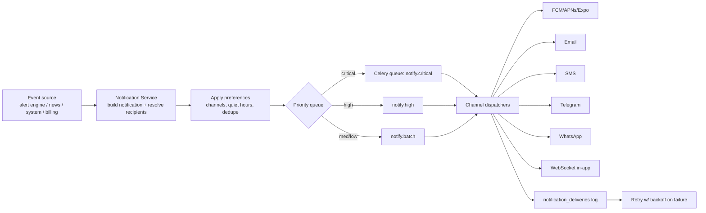

# 9. Notification Architecture

[← Back to master](../ARCHITECTURE.md)

Goal: **fastest possible delivery** of high-impact events, multi-channel, priority-tiered, with retries, offline queueing, and per-user preferences.

## 9.1 Channels

| Channel | Provider | Use |
|---------|----------|-----|
| **Push** | Expo Push / FCM (Android, Web) / APNs (iOS) | Primary mobile/web realtime |
| **Email** | SMTP / SES / Postmark | Digests, billing, verification, medium-priority |
| **SMS** | Twilio / MSG91 (India) | Critical alerts, OTP |
| **Telegram** | Bot API | Power users, instant |
| **WhatsApp** | WhatsApp Business / Twilio | Opt-in critical alerts |
| **Desktop** | Web Push (service worker) | Browser users |
| **In-app/WebSocket** | Channels | Live in-app toast + inbox |

## 9.2 Priority tiers & routing

| Priority | Examples | Channels | SLA |
|----------|----------|----------|-----|
| **Critical** | Stop-loss hit, breaking macro event, payment failure | Push + SMS + Telegram + in-app (bypass quiet hours, configurable) | < 3s |
| **High** | Price alert, high-impact news on watchlist | Push + Telegram + in-app | < 5s |
| **Medium** | Forecast update, recommendation, medium news | Push + in-app | best-effort, batched ok |
| **Low** | Digest, marketing, tips | Email digest + in-app | batched |

Routing resolves per user: requested channels ∩ user preferences ∩ verified channels ∩ quiet-hours rules (critical can override per user setting).

## 9.3 Pipeline

## 9.4 Alert evaluation engine
- **Price/indicator alerts:** as quotes stream in, a Celery/streaming evaluator matches active `alert_rules` indexed by `instrument_id`. Hot rules cached in Redis; evaluation is O(rules-per-symbol), not O(all rules).
- **News/sentiment/keyword alerts:** the news pipeline emits matched entities; rules with `news_keyword`/`sentiment` triggers are evaluated against new articles.
- **Economic-event alerts:** scheduled from `economic_calendar.event_time`.
- **Cooldown & dedupe:** `cooldown_seconds` per rule + dedupe hash `(rule_id, event_signature)` prevents storms; `last_triggered_at` enforced.

## 9.5 Reliability
- **Retry queue:** exponential backoff (e.g. 5s, 30s, 2m, 10m), max attempts per channel; failures logged in `notification_deliveries` with provider error.
- **Offline queue:** if device unreachable / token stale, notification stays in inbox (`notifications`) and is delivered via WebSocket when the client reconnects; stale push tokens pruned.
- **Idempotency:** each notification keyed; provider message IDs stored to reconcile delivery receipts (delivered/read where supported).
- **Fallback:** if a high-priority push fails, escalate to next channel (e.g. push→SMS for critical).
- **Fan-out at scale:** broadcasts (e.g. market-wide breaking news) chunked and parallelized across workers; per-user personalization (entity match to watchlist) decides recipients to avoid spamming everyone.

## 9.6 User preferences (`notification_preferences`)
Per-type × per-channel matrix (e.g. "price alerts → push+telegram, news → push only, marketing → off"), quiet hours with timezone, digest mode (off/daily/weekly), and global mute. Critical safety alerts can be set to override quiet hours.

## 9.7 Delivery tracking & inbox
- Every send → `notifications` (the inbox item) + `notification_deliveries` (per-channel attempts).
- In-app inbox served from `/notifications`; unread badge via WebSocket count.
- Admin can broadcast and view delivery analytics (sent/delivered/failed/opened) — see [Admin Panel](09-admin-panel.md).
