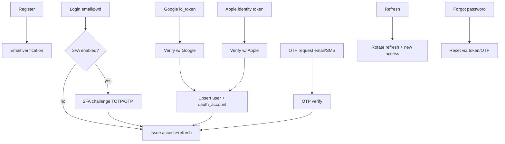

# 10–13. Authentication · User Management · Security

[← Back to master](../ARCHITECTURE.md)

---

## 10. Authentication

### 10.1 Token model (JWT + refresh rotation)
- **Access token:** short-lived JWT (15 min), `RS256` (asymmetric — AI service & gateway verify with public key). Claims: `sub`, `roles`, `plan`, `jti`, `device_id`, `exp`, `iat`.
- **Refresh token:** long-lived (30 days), opaque, stored **hashed** in `sessions`; **rotated** on every use (old one revoked → reuse detection = breach → revoke session family).
- **Storage on client:** secure storage only (iOS Keychain / Android Keystore via `expo-secure-store`; web → httpOnly secure cookie for refresh, memory for access).

### 10.2 Flows

- **Google / Apple:** verify provider token server-side, match/create `oauth_accounts`, link to existing email if present (with verification), issue tokens.
- **OTP login:** email or SMS code (`otp_codes`, hashed, TTL, attempt-limited) → tokens. Used for passwordless and 2FA.
- **Email verification & password reset:** signed, single-use, expiring tokens; reset revokes all sessions.
- **2FA:** TOTP (authenticator app) primary + OTP fallback; recovery codes issued at setup (hashed).

### 10.3 Session & device management
- `sessions` track each refresh token (device, IP, UA, expiry, revocation). `devices` track push tokens & trust.
- Users can view and revoke sessions/devices (`/auth/sessions`, `/profile/devices`).
- Suspicious login (new device/geo) → email + step-up 2FA; logged in `login_history`.

### 10.4 RBAC

Roles (in `roles`) with permission sets (`permissions` via `role_permissions`):

| Role | Capability summary |
|------|--------------------|
| **super_admin** | Everything incl. role/permission management, system settings, secrets-adjacent ops |
| **admin** | User mgmt, content/market/news/model mgmt, billing view, broadcasts |
| **moderator** | News moderation, flagged content, limited user actions |
| **premium** (pro/elite) | Full AI features, higher limits, advanced charts |
| **free** | Core data, limited AI/alerts/watchlists |
| **guest** | Public read-only (markets, news) without account |

- Enforced via DRF permission classes in `core/permissions` (role check + object ownership + plan/entitlement check).
- Permissions are **codes** (`news.publish`, `ai.train`, `user.suspend`) → fine-grained, assignable to roles without code changes.
- Plan-gating (⭐) checks `entitlements` (cached) in addition to role.

---

## 11. User Management

- **Lifecycle:** register → verify → active → (suspend/ban) → soft-delete → purge (GDPR job after retention window).
- **Profile & preferences:** country, timezone, base currency, language, risk appetite, experience level → personalize UI, recommendations, and number/currency formatting.
- **Self-service:** update profile, manage devices/sessions, manage notification prefs, manage subscription, export data (GDPR), delete account.
- **Admin-side:** search/filter users, view activity, impersonate (audited, super_admin only), suspend/restore, adjust roles/plan, see billing — see [Admin Panel](09-admin-panel.md).
- **Entitlements:** resolved from subscription → `entitlements` table + Redis cache; checked on gated endpoints (alert counts, watchlist size, AI calls/day, advanced charts).

---

## 12 & 13. Security

### Layered controls

| Layer | Control |
|-------|---------|
| **Transport** | TLS 1.2+/HTTPS everywhere; HSTS; certificate management at Nginx/ingress |
| **AuthN** | JWT RS256, refresh rotation + reuse detection, OAuth, 2FA, OTP rate-limited |
| **AuthZ** | RBAC + object ownership + plan entitlements; deny-by-default DRF permissions |
| **Input** | DRF serializers / pydantic / Zod validation on every boundary; strict types |
| **SQL injection** | ORM parameterized queries only; no raw string SQL (raw allowed only via parameterized `params=`) |
| **XSS** | API returns JSON only; clients escape; CSP headers; sanitize any HTML (news bodies) before render |
| **CSRF** | Token-based for cookie auth (web admin); SameSite cookies; Bearer tokens for mobile (not CSRF-prone) |
| **CORS** | Strict allowlist of origins per environment; credentials only where needed |
| **Rate limiting** | Redis token-bucket per IP + per user + per API key tier; stricter on auth/OTP/payment; `429 + Retry-After` |
| **Secure headers** | HSTS, X-Content-Type-Options, X-Frame-Options/frame-ancestors, Referrer-Policy, Permissions-Policy, CSP |
| **Secrets** | Env-injected; vault/cloud secret manager; never in repo; `.env` gitignored; rotation policy |
| **Encryption at rest** | DB volume encryption; field-level encryption for sensitive PII; MinIO SSE |
| **API keys** | Hashed at rest, prefix shown, scoped, rotatable, expiry, revocation, usage logged |
| **Payments** | PCI handled by PSP; we store only tokens/IDs; webhooks signature-verified; never store PAN/CVV |
| **Audit** | Append-only `audit_logs` on every privileged/admin action (before/after, actor, IP) |
| **Abuse** | Account lockout, OTP brute-force protection, bot/CAPTCHA on signup/OTP, anomaly detection on logins |
| **Dependency** | `pip-audit` / `npm audit` / Dependabot in CI; pinned versions; SBOM |
| **Data privacy** | PII minimization, data export & delete (GDPR/DPDP India), consent flags, region-aware residency |

### Service-to-service
- Django ↔ FastAPI calls use a **short-lived signed service JWT** (separate key, `aud: ai-service`), mTLS optional inside the cluster, network-policy restricted (AI service not publicly exposed).

### Threat-model highlights
- **Token theft:** short access TTL + refresh rotation + device binding + reuse detection.
- **Scraping/quota abuse:** per-key rate tiers, anomaly detection, WAF rules at Nginx.
- **Market-data leakage:** licensing-sensitive feeds gated by plan; redistribution limits enforced server-side.
- **Webhook spoofing:** signature verification + idempotency keys on all PSP webhooks.

### Secrets rotation
- DB/Redis creds, JWT signing keys (with key-id `kid` + rolling JWKS), API keys, PSP keys — all rotatable without downtime via dual-key grace windows.
